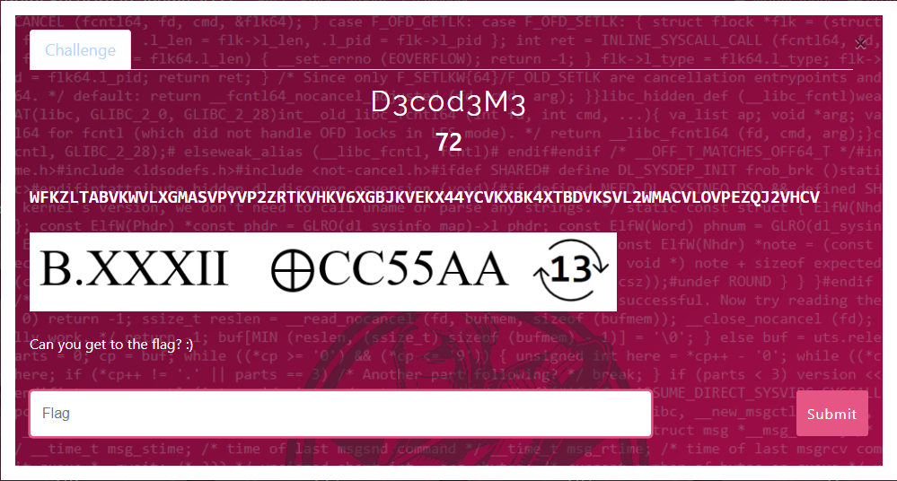

#   


## Intro
As the challenge name suggests, this is a decoding challenge.
To capture the challenge's flag, we have to decode an encoded message, according to a given sequence of steps.

I will demonstrate the process of decoding I've done using `python` programming language.

```
> encoded_message
WFKZLTABVKWVLXGMASVPYVP2ZRTKVHKV6XGBJKVEKX44YCVKXBK4XTBDVKSVL2WMACVLOVPEZQJ2VHCV
```

## Step 1
The first step is going to be `base32` decoding of the encoded message.

The `base64` module will provide us with the function to do so.

```
> from base64 import b32decode
> b32decode(encoded_message)
b'\xb1U\x95\xcc\x01\xaa\xadU\xdc\xcc\x04\xaa\xfcU\xfa\xccf\xaa\x9dU\xf5\xcc\x14\xaa\xa4U\xf9\xcc\n\xaa\xb8U\xcb\xcc#\xaa\xa5U\xea\xcc\x00\xaa\xb7U\xe4\xcc\x13\xaa\x9cU'
```

## Step 2
The second step is going to be `bitwise-XOR` of the previous output with `CC55AA`.

First, we have to understand that `CC55AA` is in hex represantation, so to read it properly we have to use a proper method to convert a hex-like str to byets
```
> bytes.fromhex('CC55AA')
b'\xccU\xaa'
```

Second, we have to understand that to `bitwise-XOR` message, we have to have a key of the equal or greater than message length. This is not our case here, so we have to split the message into `block`s of equal or less than key length and `bitwise-XOR` each `block` with key.

> You have a key K of length lK and a message M of length lM and you just go ahead and K⊕Mi for all parts Mi of the message of length at most lK.
[crypto.stackexchange.com](https://crypto.stackexchange.com/questions/24332/key-length-requirement-in-a-simple-xor-implementation)

With a quick look at [stackoverflow.com](https://stackoverflow.com/questions/29408173/byte-operations-xor-in-python) we can see how a bitwise-XOR is being done using `python` programming language.
```
> def encrypt1(var, key):
>         return bytes(a ^ b for a, b in zip(var, key))
```
Now let's wrap that with a function to split our message into lK `block`s
```
> def bitwise_xor(message, key):
>     ret = bytes()
>     for i in range(0, len(message), len(key)):
>         block = message[i:i + len(key)]
>         ret += encrypt1(block, key)
>     return ret
```
To finish
```
> bitwise_xor(b32decode(encoded_message), bytes.fromhex('CC55AA'))
b'}\x00?\x00T\x00a\x00v\x00Q\x000\x00P\x003\x00Q\x00_\x00A\x00h\x00S\x00_\x00t\x00a\x00v\x00i\x00@\x00U\x00{\x00N\x00F\x00P\x00'
```

## Step 3
The third step is going to be `ROT13` of the previous output.

The `codecs` module will provide us with the function to do so.

```
> import codecs
> codecs.decode(bitwise_xor(b32decode(encoded_message), bytes.fromhex('CC55AA')).decoded(), 'rot13')
...
TypeError: decoding with 'rot13' codec failed (TypeError: descriptor 'translate' for 'str' objects doesn't apply to a 'bytes' object)
```

Oops! `codecs.decode` raised a `TypeError` when is given `bytes` as input... let's give it `str` using `bytes.decoded` function.

```
> codecs.decode(bitwise_xor(b32decode(encoded_message), bytes.fromhex('CC55AA')).decoded(), 'rot13')
}?GniD0C3D_NuF_gniv@H{ASC
```

## Conclusion
Hmm... the previous output looks like gibberish at first glance...

With a deeper inspection we can see that this is our flag! (detrevni)

```
> codecs.decode(bitwise_xor(b32decode(encoded_message), bytes.fromhex('CC55AA')).decoded(), 'rot13')[::-1]
CSA{H@ving_FuN_D3C0DinG?}
```

Good Job! ;)